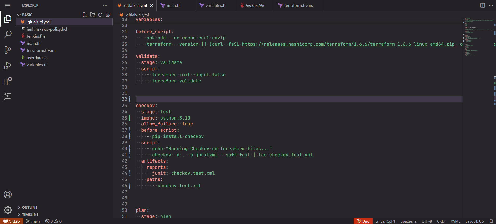

# 🛡️ Terraform CI/CD + Checkov Security Scan

This project demonstrates a secure Terraform CI/CD pipeline using **GitLab CI** and **Checkov** for infrastructure as code (IaC) scanning.

## 🔧 What’s Included

- GitLab pipeline with stages for `validate`, `plan`, `apply`, and `checkov`
- Secure Terraform example provisioning:
  - VPC
  - Subnet
  - Internet Gateway
  - EC2 Instance
- Integrated static code analysis using **Checkov**
- JUnit-formatted Checkov report uploaded to GitLab UI

---

## 📸 Screenshots

| Pipeline Overview | YAML Config | GitLab Report UI | Checkov Alert |
|-------------------|-------------|------------------|----------------|
|  |  |  |  |

---

## 🔍 Sample Finding: Overly Permissive Security Group

**File**: `main.tf`  
**Resource**: `aws_security_group.ec2_sg`  
**Check**: `[CKV_AWS_382] Ensure no security groups allow egress from 0.0.0.0/0 to port -1`  
**Severity**: Medium  
**Reference**: [Prisma Cloud Policy - Networking 2](https://docs.prismacloud.io/en/enterprise-edition/policy-reference/aws-policies/aws-networking-policies/networking-2)

```hcl
egress {
  from_port   = 0
  to_port     = 0
  protocol    = "-1"
  cidr_blocks = ["0.0.0.0/0"]
}
````

### 💡 Why It’s Risky

This configuration allows **unrestricted outbound traffic** from the EC2 instance. In case of a compromise, an attacker could exfiltrate data or reach out to malicious services freely.

---

## ✅ Recommendation

Restrict the egress traffic to only necessary ports and known IPs:

```hcl
egress {
  from_port   = 443
  to_port     = 443
  protocol    = "tcp"
  cidr_blocks = ["YOUR_ALLOWED_CIDR_BLOCK"]
}
```

---

## 🚀 How to Use

1. Clone the repo and add your AWS credentials as GitLab CI/CD environment variables.
2. Trigger the pipeline from the **GitLab UI**.
3. View **Checkov results** in the pipeline job output and **JUnit** report tab.

---

## 📂 Directory Structure

```bash
.
├── main.tf
├── variables.tf
├── .gitlab-ci.yml
├── checkov.test.xml
└── screenshots/
    ├── pipeline.png
    ├── yaml.png
    ├── report-ui.png
    └── checkov-alert.png
```

---

## ✍️ Author

Derrick Weil — Cloud & DevSecOps Engineer
GitHub: [@derricksh43](https://github.com/derricksh43)


